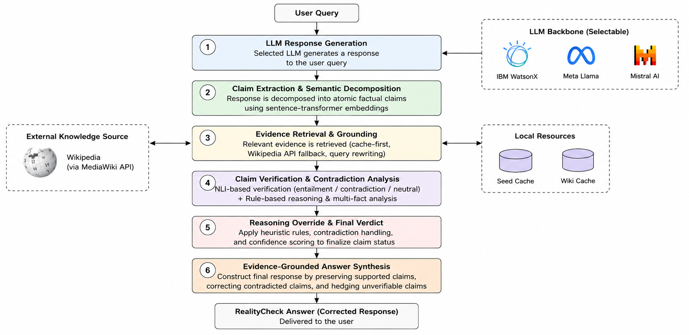
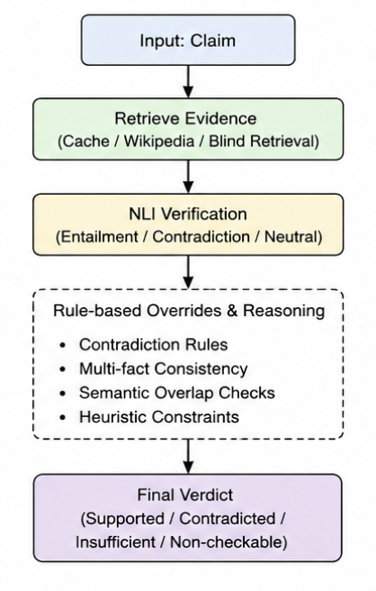
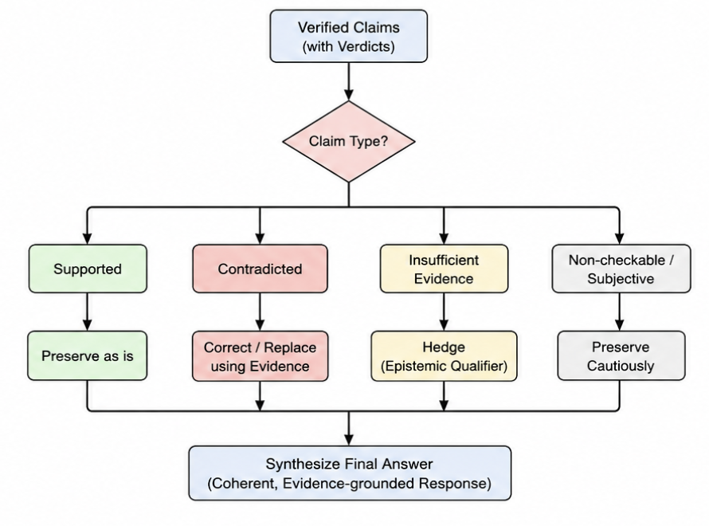

<p align='center'></p>

# RealityCheck
### LLM Hallucination Detection & Correction Pipeline

RealityCheck is a fully deterministic, evidence-grounded pipeline that catches and corrects hallucinations in large language model outputs. Feed it any question, get a raw LLM answer, and watch RealityCheck decompose that answer into individual factual claims, verify each one against Wikipedia evidence using NLI, and reconstruct a corrected response — without ever calling an LLM again in the correction step.

Built on top of IBM WatsonX AI and evaluated against the TruthfulQA benchmark, RealityCheck exposes how confidently wrong modern LLMs can be — and then fixes it.

---

## Features

- **7-phase pipeline** — end-to-end from question to corrected answer with a full verification trace at every step
- **Multi-model support** — runs Llama 3.3-70B, Mistral Medium 2505, and IBM Granite 3.3-8B via WatsonX in parallel
- **Cache-first evidence retrieval** — local seed bank → persistent disk cache → live Wikipedia, with polite rate-limiting
- **Multi-signal NLI verification** — DeBERTa cross-encoder combined with semantic overlap, entity matching, core-term frequency, and negation checking
- **Deterministic answer synthesis** — no LLM calls in the correction step; corrections are fully grounded in retrieved evidence passages
- **Temporal claim handling** — specialised verifier for age and date claims that raw NLI routinely misfires on
- **Truth margin evaluation** — semantic scoring against both correct and incorrect TruthfulQA references to measure real improvement
- **Live interactive console** — ask any question and see the full pipeline run in real time, with intermediate outputs cached between runs

---

## Pipeline Architecture

<p align='center'></p>

```
TruthfulQA Dataset / User Question
            │
            ▼
┌─────────────────────────────────────────────────────────────────┐
│                  Phase 2 — LLM Generation                       │
│   WatsonX AI (Llama 3.3-70B · Mistral Medium · Granite 3.3-8B)  │
│   Produces raw answers with metadata                            │
└─────────────────────────┬───────────────────────────────────────┘
                          │
                          ▼
┌─────────────────────────────────────────────────────────────────┐
│               Phase 3 — Claim Extraction                        │
│   Sentence splitting · Claim-worthiness filter                  │
│   Essential vs. supporting claim classification                 │
└─────────────────────────┬───────────────────────────────────────┘
                          │
                          ▼
┌─────────────────────────────────────────────────────────────────┐
│              Phase 4 — Evidence Retrieval                       │
│   Seed bank → Disk cache → Live Wikipedia queries               │
│   Semantic page ranking + chunk extraction (MiniLM embeddings)  │
└─────────────────────────┬───────────────────────────────────────┘
                          │
                          ▼
┌─────────────────────────────────────────────────────────────────┐
│              Phase 5 — Claim Verification                       │
│   NLI (DeBERTa cross-encoder) + entity / term / negation checks │
│   Labels: supported · contradicted · insufficient_evidence      │
└─────────────────────────┬───────────────────────────────────────┘
                          │
                          ▼
┌────────────────────────────────────────────────────────────────────────┐
│              Phase 6 — Answer Synthesis                                │
│   Deterministic reconstruction — no LLM calls                          │
│   Supported → kept · Contradicted → corrected · Insufficient → omitted │
└─────────────────────────┬──────────────────────────────────────────────┘
                          │
                          ▼
┌─────────────────────────────────────────────────────────────────┐
│              Phase 7 — Semantic Evaluation                      │
│   Truth margin = sim(correct refs) − sim(incorrect refs)        │
│   Tracks: fixed wrong · overcorrected · preserved correct       │
└─────────────────────────────────────────────────────────────────┘
```

---

## Claim Verification

<p align='center'></p>

Phase 5 deliberately avoids relying on NLI alone. Each claim passes through a sequence of checks before a final label is assigned:

1. **Evidence filtering** — low-similarity chunks are dropped before they reach the NLI model
2. **Semantic overlap** — sentence-transformer cosine similarity between claim and evidence passage
3. **Core-term frequency** — checks that key nouns from the claim actually appear in the evidence
4. **Entity overlap** — matches named entities (people, places, organisations) between claim and passage
5. **Negation consistency** — detects negation mismatches that fool standard NLI
6. **Temporal verification** — dedicated handler for age and date claims using numeric extraction
7. **NLI cross-encoder** — `cross-encoder/nli-deberta-v3-base` produces the final entailment score

---

## Answer Synthesis

<p align='center'></p>

Phase 6 rebuilds the answer deterministically using the verification trace from Phase 5:

| Verification Label | Action |
|---|---|
| `supported` | Claim is kept verbatim |
| `contradicted` | Claim is replaced with an evidence-grounded correction |
| `insufficient_evidence` | Claim is omitted from the final answer |

The synthesiser deduplicates corrected sentences and assigns a status label to the whole answer: `fully_supported`, `corrected_from_contradiction`, `partially_supported_with_omissions`, or `could_not_verify`.

---

## Tech Stack

<p align='center'>


</p>

| Component | Technology |
|---|---|
| LLM Inference | Meta Llama 3.3-70B · Mistral Medium 2505 · IBM Granite 3.3-8B via IBM WatsonX AI |
| NLI Verifier | `cross-encoder/nli-deberta-v3-base` (HuggingFace) |
| Retrieval Embeddings | `sentence-transformers/multi-qa-MiniLM-L6-dot-v1` |
| Evaluation Embeddings | `sentence-transformers/all-MiniLM-L6-v2` |
| Evidence Source | Wikipedia (Wikimedia REST API) |
| Benchmark | TruthfulQA |
| Data Layer | JSON + persistent file-based Wikipedia cache |

---

## Project Structure

```
RealityCheck/
├── Docs/
│   ├── RealityCheck_logo.webp
│   ├── fig1_pipeline_architecture.png
│   ├── fig2_claim_verification_flow.png
│   ├── fig3_answer_synthesis.png
│   └── Projects_Logs.txt              # Phase-by-phase execution guide
│
└── codebase/
    ├── requirements.txt
    ├── Database/
    │   ├── truthfulqa_processed/      # Pre-processed TruthfulQA benchmark
    │   └── live_runs/                 # Cached outputs from Live Console sessions
    │
    ├── Phase_2/                       # LLM answer generation
    │   ├── src/
    │   │   ├── config.py              # WatsonX credentials + generation params
    │   │   ├── experiment_runner.py   # Batch generation entry point
    │   │   └── watsonx_client.py      # WatsonX API wrapper
    │   ├── data/                      # TruthfulQA input dataset
    │   └── outputs/                   # Raw LLM responses (JSON)
    │
    ├── Phase_3/                       # Claim extraction
    │   └── src/
    │       ├── claim_extractor.py     # Sentence splitting + claim-worthiness filter
    │       └── phase3_runner.py
    │
    ├── Phase_4/                       # Evidence retrieval
    │   ├── src/
    │   │   ├── retriever.py           # Main ranking + chunking engine
    │   │   ├── wiki_client.py         # Wikipedia + cache interaction layer
    │   │   ├── embedder.py            # Semantic similarity scoring
    │   │   ├── query_builder.py       # Search query construction
    │   │   ├── chunker.py             # Evidence passage chunking
    │   │   └── local_evidence_bank.py # Seed evidence for TruthfulQA facts
    │   └── .phase4_wiki_cache/        # Persistent Wikipedia response cache
    │
    ├── Phase_5/                       # NLI verification
    │   └── src/
    │       ├── claim_verifier.py      # Multi-signal verification logic
    │       ├── nli_verifier.py        # DeBERTa NLI model wrapper
    │       ├── evidence_filter.py     # Pre-NLI chunk filtering
    │       └── temporal_verifier.py   # Age + date claim handling
    │
    ├── Phase_6/                       # Answer synthesis
    │   └── src/
    │       ├── answer_synthesizer.py  # Decision engine + correction logic
    │       └── phase6_runner.py
    │
    ├── Evaluation/                    # Phase 7 — semantic evaluation
    │   └── src/
    │       ├── phase7_runner.py       # Batch evaluation entry point
    │       ├── semantic_scorer.py     # Sentence similarity computation
    │       ├── evaluation_core.py     # Answer quality judgement
    │       └── loaders.py             # TruthfulQA reference loader
    │
    └── Live_Console/                  # Interactive real-time pipeline
        └── src/
            └── realitycheck_console.py  # Console orchestrator (all 6 phases)
```

---

## Local Setup

### Prerequisites

- Python 3.10+
- An IBM WatsonX account with an API key and project ID

### 1 — Clone the repository

```bash
git clone https://github.com/Vishesh-Goyal7/RealityCheck
cd RealityCheck/codebase
```

### 2 — Python environment

```bash
python3.10 -m venv venv
source venv/bin/activate          # Windows: venv\Scripts\activate
pip install --upgrade pip
pip install -r requirements.txt
```

### 3 — Environment variables

Create `codebase/Phase_2/.env`:

```dotenv
# IBM WatsonX credentials (required)
WATSONX_URL=https://us-south.ml.cloud.ibm.com
WATSONX_API_KEY=your_api_key_here
WATSONX_PROJECT_ID=your_project_id_here

# Model IDs (optional — defaults shown)
WATSONX_LLAMA_MODEL_ID=meta-llama/llama-3-3-70b-instruct
WATSONX_MISTRAL_MODEL_ID=mistralai/mistral-medium-2505
WATSONX_GRANITE_MODEL_ID=ibm/granite-3-3-8b-instruct

# Generation params (optional — defaults shown)
WATSONX_MAX_COMPLETION_TOKENS=80
WATSONX_TEMPERATURE=0.1
WATSONX_TOP_P=1.0
```

---

## How to Use

### Option A — Live Console (recommended for quick testing)

Run the interactive console from the `codebase/` directory. Type any question and the full pipeline runs in real time.

```bash
cd codebase
source venv/bin/activate

# Choose your model: llama | mistral | granite
python Live_Console/src/realitycheck_console.py --model granite
```

### Option B — Batch Pipeline (full TruthfulQA evaluation)

Run each phase sequentially from its own directory.

**Phase 2 — Generate LLM answers**
```bash
cd codebase/Phase_2
PYTHONPATH=src python src/experiment_runner.py --model llama --sample-size 20 --seed 15
PYTHONPATH=src python src/experiment_runner.py --model mistral --sample-size 20 --seed 15
PYTHONPATH=src python src/experiment_runner.py --model granite --sample-size 20 --seed 15
```

**Phase 3 — Extract claims**
```bash
cd codebase/Phase_3
PYTHONPATH=src python src/phase3_runner.py \
  --input ../Phase_2/outputs/llama_20_chatfixed.json \
  --output outputs/model_claims_llama.json
```

**Phase 4 — Retrieve Wikipedia evidence**
```bash
cd codebase/Phase_4
export REALITYCHECK_USER_AGENT="RealityCheck/0.7 (student research; contact: your_email@example.com)"
export REALITYCHECK_WIKI_DELAY=2.5
PYTHONPATH=src python src/phase4_runner.py \
  --inputs ../Phase_3/outputs/model_claims_llama.json \
  --output-dir outputs \
  --top-pages 3 \
  --candidate-pages 8 \
  --top-chunks 5
```

**Phase 5 — Verify claims**
```bash
cd codebase/Phase_5
PYTHONPATH=src python src/phase5_runner.py \
  --inputs ../Phase_4/outputs/model_claims_llama_with_evidence_final.json \
  --output-dir outputs
```

**Phase 6 — Synthesise corrected answers**
```bash
cd codebase/Phase_6
PYTHONPATH=src python src/phase6_runner.py \
  --inputs ../Phase_5/outputs/model_claims_llama_with_verification.json \
  --output-dir outputs
```

**Phase 7 — Evaluate**
```bash
cd codebase
python Evaluation/src/phase7_runner.py \
  --phase6 Phase_6/outputs/model_claims_llama_with_corrected_answers.json \
  --phase5 Phase_5/outputs/model_claims_llama_with_verification.json \
  --truthfulqa Phase_2/data/truthfulqa_processed.json \
  --output-dir Evaluation/outputs
```

---

## Configuration Reference

| Variable | Default | Description |
|---|---|---|
| `WATSONX_URL` | — | WatsonX endpoint URL (required) |
| `WATSONX_API_KEY` | — | IBM Cloud API key (required) |
| `WATSONX_PROJECT_ID` | — | WatsonX project ID (required) |
| `WATSONX_LLAMA_MODEL_ID` | `meta-llama/llama-3-3-70b-instruct` | Llama model ID |
| `WATSONX_MISTRAL_MODEL_ID` | `mistralai/mistral-medium-2505` | Mistral model ID |
| `WATSONX_GRANITE_MODEL_ID` | `ibm/granite-3-3-8b-instruct` | Granite model ID |
| `WATSONX_MAX_COMPLETION_TOKENS` | `80` | Max tokens per LLM response |
| `WATSONX_TEMPERATURE` | `0.1` | Sampling temperature |
| `REALITYCHECK_WIKI_DELAY` | `2.5` | Seconds between Wikipedia requests |
| `REALITYCHECK_MAX_QUERIES_PER_CLAIM` | `3` | Max Wikipedia queries per claim |

---

## License

MIT License © 2026 VisheshVerse

---

## Author

RealityCheck grew from a single question — *can we build a system that doesn't just detect hallucinations but actually fixes them, without asking an LLM to grade its own homework?* The answer turned out to be a seven-phase pipeline, three embedding models, a Wikipedia cache, and a lot of debugging NLI edge cases.

Feel free to ⭐ the repo or reach out at visheshvishu1@outlook.com

**Vishesh Goyal**
[GitHub](https://github.com/Vishesh-Goyal7) | [LinkedIn](https://linkedin.com/in/vishesh-goyal-2k5) | [Personal Portfolio](https://visheshverse.com)

---

<p align='center'>Developed and Maintained by <a href='https://visheshverse.com'>VisheshVerse</a></p>
